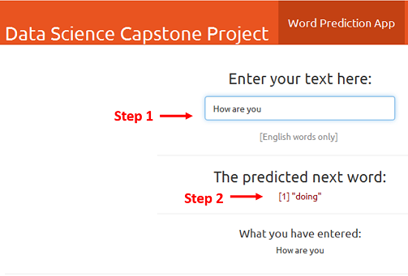

### Word Prediction Application

This application is one of the requirements of the capstone project for the Coursera Data Science specialization.

******

#### Objective of this app

The main goal of this capstone project is to build a shiny application that is able to predict the next word. 

Text data from blogs, news and twitter articles are combined and used to create a reactive prediction model that predicts next word from input word/phrase.

******

#### Algorithm development

- Corpus created from above data sample is cleaned [e.g.removing punctuation, links, white space, numbers, special characters and conversion to lowercase].

- This data sample tokenized into N-grams [unigrams to quadgrams]. 

- The N-gram term frequency matrices are transferred into data frames of frequency dictionaries.

- Resulting data frames are used to predict the next word for the word/phrase input by the user modeled on the frequencies of next occuring words in N-grams table.

******

#### How to use the app

The app is developed mainly for use of mobile phone users. App use involes two main steps (see screenshot below):
  1. Enter word/phrase 
  2. Next word suggestion is displayed instantly

